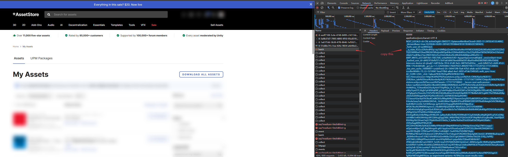

# Unity Asset Store 일괄 다운로드 도구

Unity Asset Store에서 구매한 모든 에셋을 일괄 다운로드합니다.

## 기능

- **에셋 목록 가져오기** - GraphQL API로 페이지네이션 조회 (페이지당 100개)
- **제품 상세 정보 가져오기** - 이름, 크기, 버전, 카테고리 등 전체 정보
- **일괄 다운로드** - 스레드 풀을 이용한 `.unitypackage` 파일 동시 다운로드
- **이어받기 지원** - 중단 후 재실행 시 마지막 위치에서 자동으로 재개
- **다운로드 진행률** - 실시간 진행률 바, 속도, 예상 남은 시간 표시
- **증분 가져오기** - 재시작 시 이미 가져온 페이지와 상세 정보를 자동 건너뛰기
- **자동 재시도** - 5xx 오류, 타임아웃, 연결 오류 발생 시 지수 백오프로 재시도

## 요구 사항

```bash
pip install requests
```

## 설정

1. 예제 설정 파일을 복사:
   ```bash
   cp config.json.example config.json
   ```
2. 브라우저에서 [Unity Asset Store](https://assetstore.unity.com)에 로그인
3. 개발자 도구(F12) > Network 탭 > 아무 요청에서 `Cookie` 헤더를 복사
4. `config.json`의 `cookie` 필드에 붙여넣기:

```json
{
  "cookie": "여기에 Cookie 문자열을 붙여넣으세요",
  "download_dir": "./downloads",
  "max_workers": 3,
  "retry": 3,
  "timeout": 300
}
```

| 필드 | 설명 |
|---|---|
| `cookie` | 브라우저에서 복사한 전체 Cookie 문자열 |
| `download_dir` | 다운로드 저장 디렉토리 |
| `max_workers` | 스레드 풀 동시 실행 수 (권장: 3, 너무 크면 속도 제한 가능) |
| `retry` | 요청 실패 시 재시도 횟수 |
| `timeout` | 요청 타임아웃 (초) |

## 사용법

```bash
python asset_store_download.py
```

실행하면 메뉴가 표시됩니다:

```
1. 에셋 목록 가져오기      - 목록 + 상세 정보를 가져와 JSONL 파일에 저장
2. 다운로드 시작            - asset_ids.txt의 ID로 .unitypackage 파일 다운로드
3. 목록 가져오기 & 다운로드 - 위 두 단계를 순서대로 실행
```

## 출력 파일

| 파일 | 설명 |
|---|---|
| `asset_list.jsonl` | 한 줄에 하나의 JSON, 각 페이지의 `searchMyAssets` 데이터 (`page` 필드 포함) |
| `asset_info.jsonl` | 한 줄에 하나의 JSON, 제품 상세 정보 객체 |
| `asset_ids.txt` | 한 줄에 하나의 제품 ID, 다운로드 입력으로 사용 |
| `downloads/` | 다운로드된 `.unitypackage` 파일 |

## 이어받기 동작

- **목록 가져오기**: `asset_list.jsonl`을 읽어 누락된 페이지를 감지하고 해당 페이지만 가져오기
- **상세 정보 가져오기**: `asset_info.jsonl`을 읽어 이미 가져온 제품 ID를 건너뛰기
- **파일 다운로드**: `.tmp` 파일을 감지하고 `Range` 헤더로 마지막 바이트 위치에서 재개
